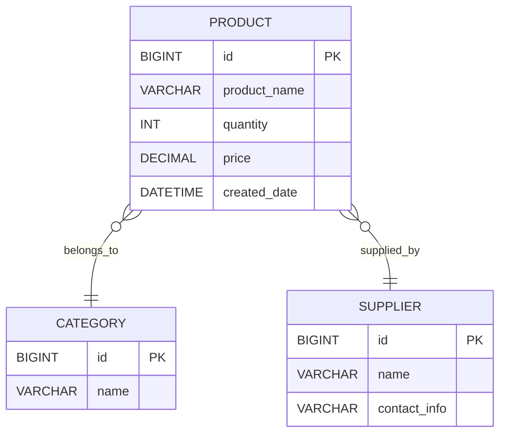

# Database / ER Diagram — Inventory Management System

This project uses a single-entity schema: one table, `products_product`,
which stores every field required by the SOP. There are no foreign key
relationships because the system manages one entity (Product). The diagram
below documents the table structure, data types, and constraints in
Entity-Relationship (Chen/Mermaid) notation.

## Entity-Relationship Diagram

```mermaid
erDiagram
    PRODUCT {
        BIGINT      id            PK "Auto-increment, Product ID"
        VARCHAR(150) product_name  "NOT NULL"
        VARCHAR(50)  category      "NOT NULL, choice list"
        INT          quantity      "NOT NULL, >= 0"
        DECIMAL(10,2) price        "NOT NULL, >= 0"
        VARCHAR(150) supplier      "NOT NULL"
        DATETIME     created_date  "NOT NULL, auto-set on create"
        DATETIME     updated_date  "NOT NULL, auto-set on update"
    }
```

> `stock_status` is **not** a stored column. It is calculated on the fly
> from `quantity` (see `backend/products/models.py`) so it can never drift
> out of sync with the real stock count:
> - `quantity == 0` → `Out of Stock`
> - `0 < quantity <= 10` → `Low Stock`
> - `quantity > 10` → `In Stock`

## Table Definition (MySQL)

Django's ORM generates and manages this table automatically through
migrations (`python manage.py migrate`), but the equivalent raw SQL is
shown here for reference and for the project report:

```sql
CREATE TABLE products_product (
    id            BIGINT AUTO_INCREMENT PRIMARY KEY,
    product_name  VARCHAR(150) NOT NULL,
    category      VARCHAR(50)  NOT NULL DEFAULT 'Other',
    quantity      INT UNSIGNED NOT NULL DEFAULT 0,
    price         DECIMAL(10,2) NOT NULL,
    supplier      VARCHAR(150) NOT NULL,
    created_date  DATETIME(6) NOT NULL,
    updated_date  DATETIME(6) NOT NULL
);
```

## Constraints Applied

| Field         | Constraint                                              |
|---------------|----------------------------------------------------------|
| id            | Primary key, auto-increment, unique                      |
| product_name  | NOT NULL, min length 2 (enforced in the API layer)        |
| category      | NOT NULL, restricted to a fixed choice list               |
| quantity      | NOT NULL, integer, must be `>= 0`                          |
| price         | NOT NULL, decimal, must be `>= 0`                          |
| supplier      | NOT NULL                                                  |
| created_date  | NOT NULL, set automatically once, never changes            |
| updated_date  | NOT NULL, updated automatically on every save               |

## Why a single table is enough

The SOP's required fields (Product ID, Product Name, Category, Quantity,
Price, Supplier, Stock Status, Created Date) all describe attributes of one
entity — a Product. There is no second entity (e.g. no separate "Supplier"
or "Category" management screen requested), so a single, well-constrained
table is the correct and simplest design. If the system grows later,
`category` and `supplier` could be split into their own tables with a
foreign key from `Product` — the diagram below shows how that
future-proofed version would look:



This is **not** implemented in the current version (it would add
complexity beyond what the SOP asks for), but it is documented here to
show the natural extension path.
